## 1. Instalacion de NodeJS y VSCode

### 1.1 Instalación de NodeJS

- **Descarga de NodeJS**  
  - Descarga el instalador de NodeJS desde [*NodeJS*](https://nodejs.org/en)
  - Instala el instalador
  - Sigue las instrucciones para instalar NodeJS
    - 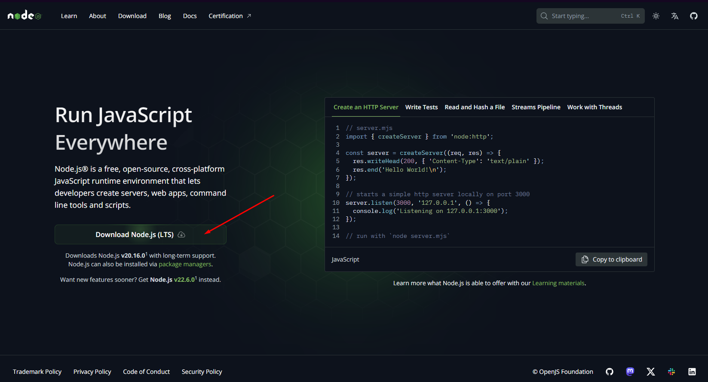
    - 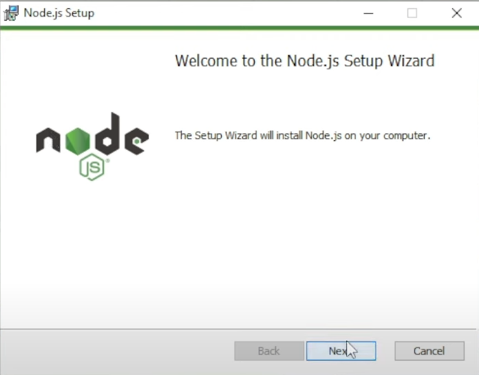
    - 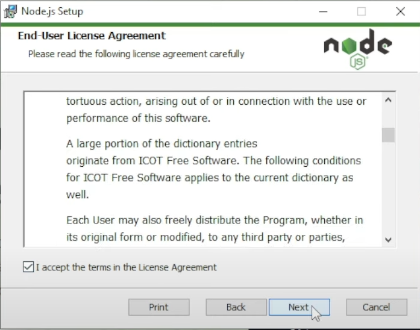
    - 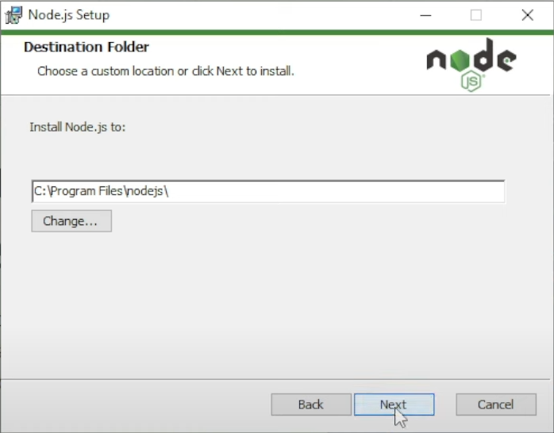
    - 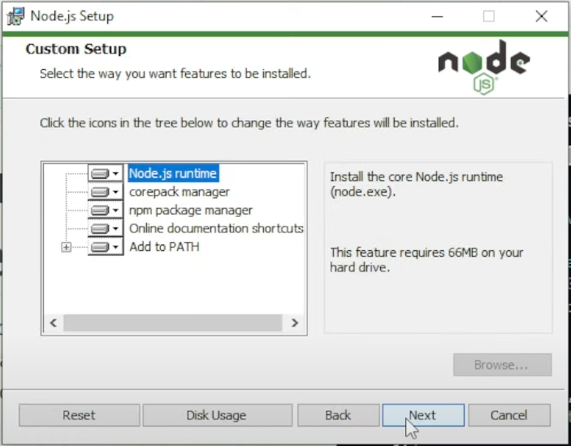
    - 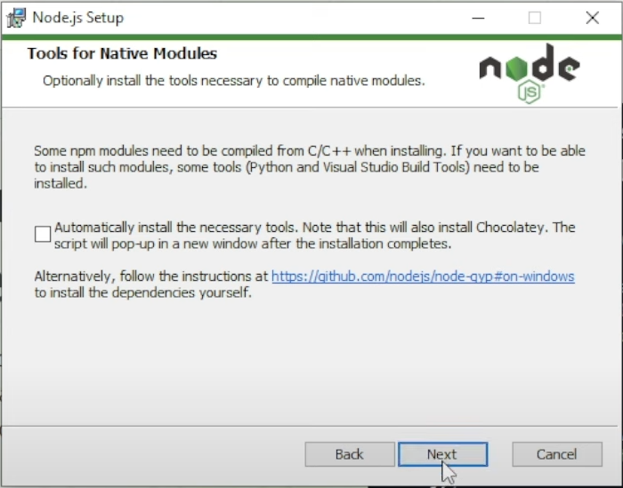
    - 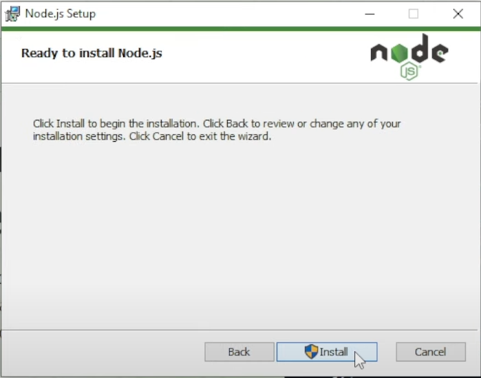
    - 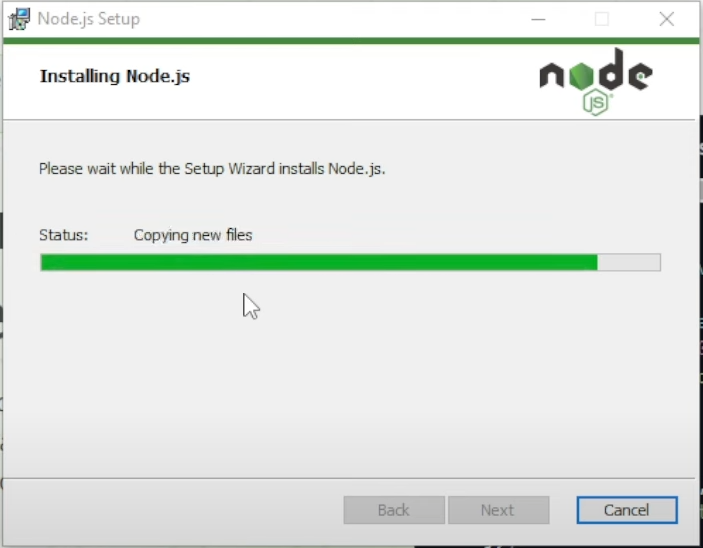
    - 

- **Instalación de VSCode**  
  - Descarga el instalador de VSCode desde [*Visual Studio Code*](https://code.visualstudio.com/download)
  - Instala el instalador
  - Sigue las instrucciones para instalar VSCode
    - 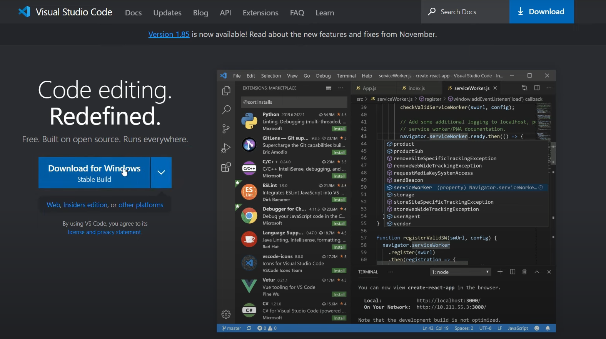
    - 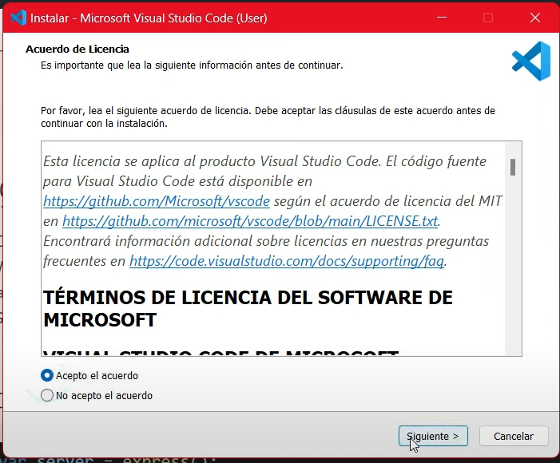
    - 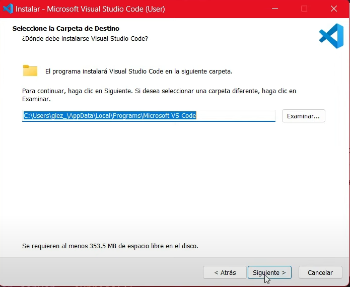
    - 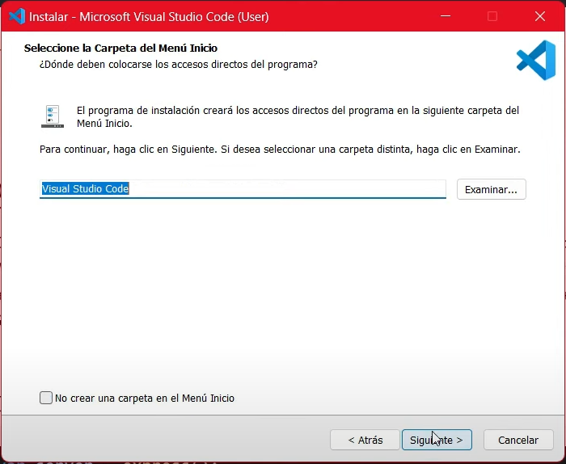
    - Importante: Selecciona todas las casillas de verificación.
    - 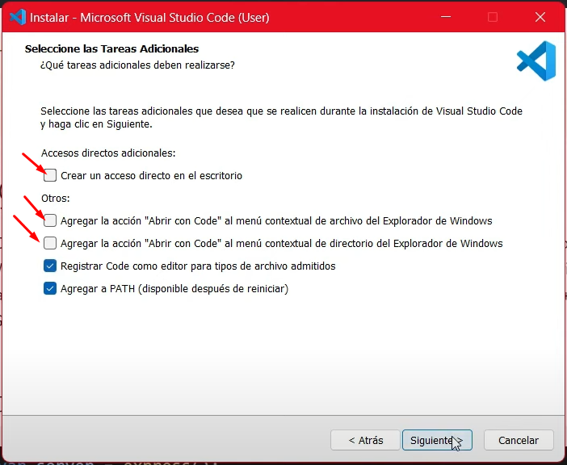
    - 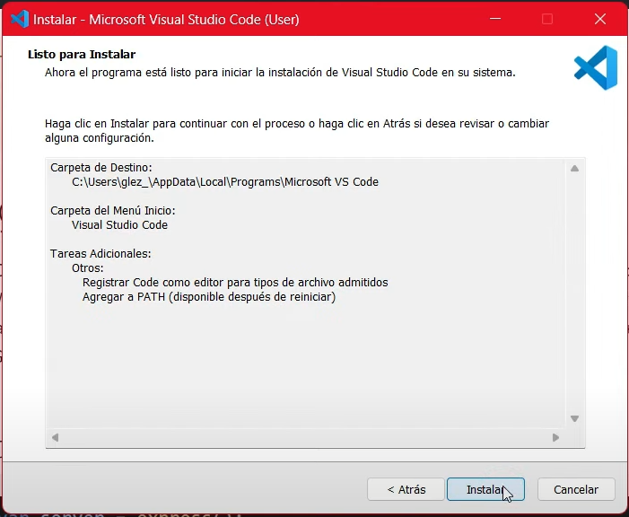
    - 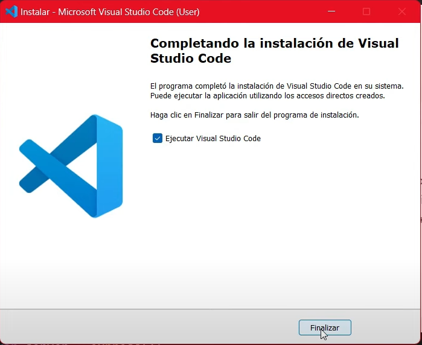

**[↩️Regresar al inicio](../README.md)**