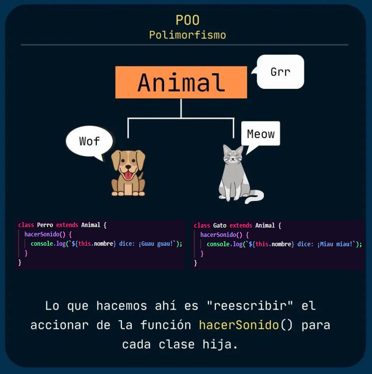

# 2. Herencia y Polimorfismo en Programación Orientada a Objetos

---
## ¿Qué es la Herencia?

La **herencia** es un mecanismo en la Programación Orientada a Objetos (POO) que permite que una clase (subclase) herede atributos y métodos de otra clase (superclase). Esto promueve la reutilización del código y la creación de estructuras jerárquicas.

### Ejemplo en JavaScript:

```javascript
// Superclase
class Animal {
  constructor(nombre) {
    this.nombre = nombre;
  }

  hacerSonido() {
    console.log(`${this.nombre} está haciendo un sonido.`);
  }
}

// Subclase que hereda de Animal
class Perro extends Animal {
  hacerSonido() {
    console.log(`${this.nombre} dice: ¡Guau guau!`);
  }
}

// Crear una instancia de la subclase
const miPerro = new Perro("Firulais");
miPerro.hacerSonido();  // Salida: Firulais dice: ¡Guau guau!
```

### Representación Gráfica de la Herencia:

```plaintext
+-----------------+
|     Animal      |  <--- Superclase
+-----------------+
| - nombre        |
+-----------------+
| + hacerSonido() |
+-----------------+
        ▲
        |
+-----------------+
|     Perro       |  <--- Subclase
+-----------------+
| + hacerSonido() |
+-----------------+
```

En el diagrama, `Perro` hereda de `Animal`, lo que significa que `Perro` puede usar los atributos y métodos definidos en `Animal`.

---

## ¿Qué es el Polimorfismo?

El **polimorfismo** es la capacidad de usar una misma interfaz para distintos tipos de objetos. En otras palabras, permite que métodos con el mismo nombre puedan tener comportamientos diferentes según la clase que los implemente.

### Ejemplo en JavaScript:

```javascript
class Gato extends Animal {
  hacerSonido() {
    console.log(`${this.nombre} dice: ¡Miau miau!`);
  }
}

const miGato = new Gato("Michi");
const animales = [miPerro, miGato];

animales.forEach(animal => animal.hacerSonido());
/* Salida:
   Firulais dice: ¡Guau guau!
   Michi dice: ¡Miau miau!
*/
```

### Representación Gráfica del Polimorfismo:



En este ejemplo, `Perro` y `Gato` son subclases de `Animal` y cada una implementa su propia versión del método `hacerSonido()`. El polimorfismo permite que usemos una misma llamada (`animal.hacerSonido()`) para todos los objetos, sin importar su tipo específico.

---

## Beneficios de la Herencia y el Polimorfismo

1. **Reutilización del Código**: La herencia permite definir nuevas clases basadas en clases existentes, reduciendo la duplicación de código.
2. **Facilidad de Mantenimiento**: Cambios en la superclase se reflejan automáticamente en las subclases.
3. **Flexibilidad y Extensibilidad**: El polimorfismo hace que sea fácil agregar nuevas funcionalidades sin alterar el código existente.
4. **Modularidad**: Facilita la creación de módulos independientes que interactúan a través de interfaces comunes.

---

## Conclusión

La herencia y el polimorfismo son conceptos fundamentales en la POO que promueven la reutilización, flexibilidad y mantenibilidad del código. Comprender estos conceptos es clave para construir aplicaciones escalables y modulares.

**[↩️ Regresar al índice](../README.md)**
